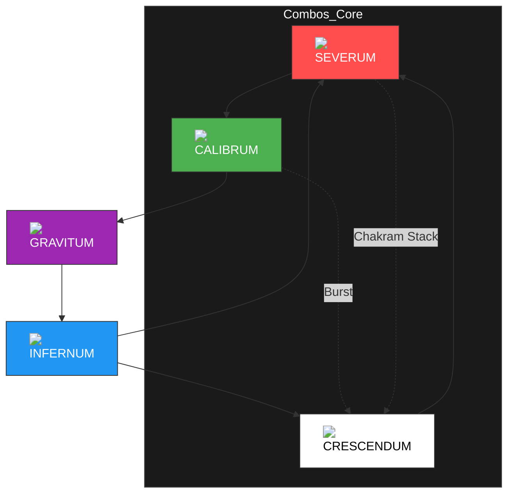

# <p align="center">🔮 ALUNE.SYS - APHELIOS SYSTEM OS 🔮</p>

<p align="center">
  
  
  
  
</p>

---

## `[//] PROCESANDO MATRIZ DE COACHING PROFESIONAL...`

```javascript
/* LCK_CORE_INSTRUCTIONS */
const MatchProtocol = {
    objective: "Symmetry of weapon rotation for 100% high-tier outcome",
    micro: "Buffering A-click cancels, weapon cooldown buffering",
    macro: "Wave 3 crash, Cheater Recall, Min 8 herald priority",
    coach_tip: "Space spacing vs auto spacing. Keep the edge."
};

console.log(`[SYS] Alune: "Everything according to the flow of the moon."`);
```

---

## 📖 Tabla de Contenidos
1.  [Ciclo Perfecto de Armas (The Apex Rotation)](#-1-ciclo-perfecto-de-armas)
2.  [Matriz de Matchups Ampliada (All Bot Lanes)](#-2-matriz-de-matchups)
3.  [Matriz de Sinergias (All Supports Tiers)](#-3-matriz-de-sinergias)
4.  [Macro-Gaming & Kiting (Coach Protocol)](#-4-macro-gaming--kiting)
5.  [Protocolos de Combate (Consejos del Analista GM)](#-5-protocolos-de-combate)

---

## 🌀 1. Ciclo Perfecto de Armas (The Apex Rotation)

El orden de las armas es lo que separa a un usuario de Aphelios de un **System Master**. 



---

## 📊 2. Matriz de Matchups Ampliada (Bot Lanes Meta 2026)

| Duo Bot Enemigo | Dificultad | Support Counter | Win Rate | Micro-Strategy (Coach Note) |
| :--- | :---: | :--- | :---: | :--- |
| **Lucian + Nami** | 🔴 Alta | Thresh / Braum | 47.1% | **Burst Alert**. Abusar de Calibrum para Poke. Usar Gravitum si Lucian usa E agresiva. |
| **Zeri + Yuumi** | 🟢 Baja | Nautilus / Pyke | 52.3% | Escalado Libre. Castigar con range Calibrum, Infernum R en teamfight gana la partida. |
| **Jinx + Lulu** | 🟡 Media | Blitzcrank | 49.5% | Skale similar. Focus en peel. Evitar el dive de su jungla. |
| **Draven + Leona** | 💀 Extrema | Morgana / Janna | 44.0% | **ZONA DE PELIGRO**. Juega defensivo. Usa Severum para absorber daño y Gravitum para farmear seguro. |
| **Kai'Sa + Nautilus**| 🟡 Media | Braum / Taric | 50.5% | Evitar trades aislados (Pasiva). Infernum para limpiar oleada y forzarla bajo torre. |
| **Caitlyn + Lux** | 🔴 Alta | Soraka / Lulu | 46.8% | Te superan en rango. Limpia Wave rápido con Infernum para anular su seige bajo torre. |
| **Samira + Rell** | 🟡 Media | Alistar / Janna | 51.2% | Mantén `Gravitum Q` lista. Cancela su Ultimate instantáneamente antes de que cargue. |
| **Ezreal + Karma** | 🟢 Baja | Nami | 53.0% | Minions bloquean su Poke. Carga Crescendum y haz All-In si gastan su CD en minions. |
| **Xayah + Rakan** | 🟡 Media | Nautilus | 49.8% | Cuidado con su plumas. Gravitum para rootear si Rakan intenta saltar. |
| **Twitch + Milio** | 🔴 Alta | Blitzcrank | 48.2% | **Sub-Stealth Alert**. No pushees solo sin visión cercana. Controla el mapa. |

---

## 🤝 3. Matriz de Sinergias (Todos los Supports)

El rendimiento de Aphelios depende del soporte. Aquí está la clasificación técnica.

### 🌟 Tier Divine (Perfect Match)
*   **Thresh**: La linterna (W) otorga la movilidad que Aphelios no tiene. `Lantern + Gravitum Root` es un gank mortal.
*   **Milio**: Aumenta el Rango de `Calibrum` exponencialmente. El rango de Aphelios se vuelve absurdo para zonear.

### 🟢 Tier S (Hyper-Scaling)
*   **Lulu**: El buff de velocidad de ataque y polimorfismo con `Crescendum` activo es el mayor DPS del juego.
*   **Nautilus**: Lock-down perfecto. Cadena de CC: `Nautilus R -> Auto -> Gravitum Root`.
*   **Nami**: Otorga velocidad, daño y curación para sobrevivir trades agresivos en early.

### 🟡 Tier A (Utility / Sustain)
*   **Braum**: El escudo intercepta projectiles mientras stackeas `Crescendum`. Perfecta defensa.
*   **Soraka / Sona**: Sustain infinito en línea. Permite tradear continuamente con `Severum` sin miedo a morir.
*   **Janna**: Protección contra assasins y poke continuo.
*   **Morgana**: `Black Shield` evita que te rooteen o enganchen si estás en posición de `Crescendum` cercano.

### 🔴 Tier B/C (Niche / Risky)
*   **Yuumi**: Te deja solo en fase de líneas. Muy débil contra hooks (Blitz/Nautilus).
*   **Lux / Brand / Zyra (Mages)**: Roban oro de la línea y no aportan peel defensivo. Dependes 100% de tu posicionamiento.

---

## 🧠 4. Macro-Gaming & Kiting (Coach Protocol)

### 🖱️ 4.1. Mecánicas de Kiting (Space Spacing)
Un Analista LCK prioriza el **Auto-Spacing**:
1.  **A-Click Technique**: Configura el "Attack Move on Cursor". No hagas click derecho en el enemigo, hazlo en el suelo cerca de él mientras retrocedes. Esto cancela la animación de *Backswing* (levantada de arma) más rápido.
2.  **Kiting de Rango (Calibrum)**: Mantén al enemigo en la punta de tu rango máximo. Cada vez que el enemigo de un paso adelante, tú das un paso atrás. 
3.  **Kiting de Proximidad (Crescendum)**: Las cuchillas de Crescendum regresan más rápido cuanto más cerca estés del objetivo. Si estás seguro, **camina hacia adelante** para multiplicar tu DPS.

### 🛡️ 4.2. Control de Oleadas y Waves (Laning Theory)
-   **Wave 1 y 2 (Slow Push)**: Solo da Last Hit. Deja que la wave 2 se acumule.
-   **Wave 3 Crash**: Empuja agresivamente para meter la wave 3 bajo la torre enemiga. Esto fuerza un **Cheater Recall** (Back a base).
-   **El Regreso**: Vuelves con una Espada Larga o Botas antes que el rival, obteniendo ventaja de estadísticas sin haber muerto.

---

## 💡 5. Protocolos de Combate (GM Analyst Notes)

> [!CAUTION]
> **Error Común**: Nunca entres a una pelea de dragón con menos de 10 balas en tu arma principal intentando que "cicle a otra". La transición de arma tiene un Delay de 0.5s donde no puedes auto-atacar.

> [!IMPORTANT]
> **Gestión de Weapon order antes de objetivos**: 
> - Minuto 7: Preparar `Gravitum` + `Infernum` para control de área en el primer Dragón.
> - Minuto 20+: Preparar `Calibrum` + `Crescendum` para deconstruir Baron Nashor o estructuras.

---

## 🛠️ 6. Estructura del Sistema

- [`matchups.json`](./matchups.json): Base de datos en JSON con estadísticas de campeones ampliadas.
- [`builds.yml`](./builds.yml): Configuraciones de objetos dinámicas.
- [`scripts/combos.md`](./scripts/combos.md): Manual de mecánicas para el campo de pruebas.

---
<p align="center"><i>"The moon will guide us." - Alune</i></p>
