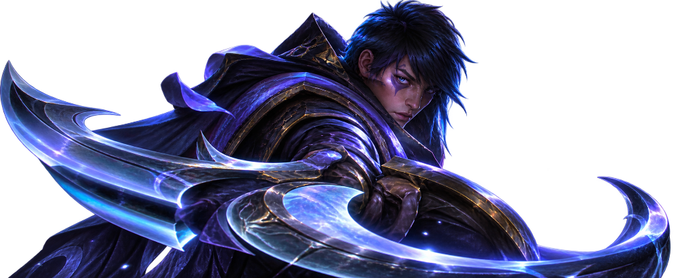
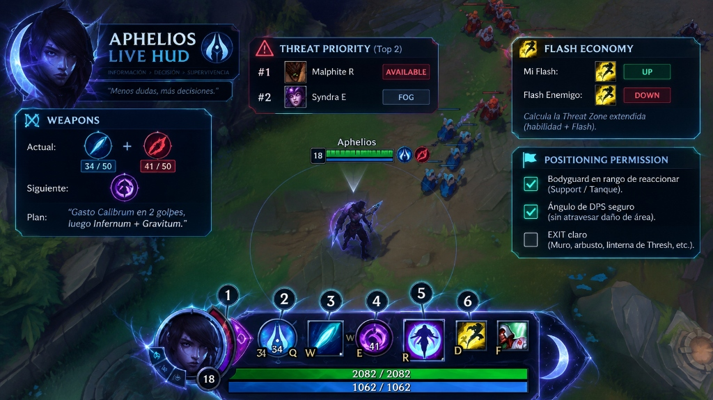

  
  
  #  La Guía Definitiva de Aphelios
  **Masterclass Nivel Challenger: Posicionamiento, Geometría y Macroestrategia**

---

##  Introducción: El Sistema de Decisiones

**NO leas esta guía esperando aprender "combos mecánicos".**
Aphelios no es un campeón de memorización muscular. Es un sistema dinámico. Si juegas en piloto automático, estás jugando en inferioridad. Cada click que haces debe ser una respuesta calculada a la función matemática del estado actual de la partida.

**Tu decisión de posicionamiento es el resultado de:**
`F(Armas actuales, Munición, Siguiente arma, Posición del Enemigo, Distancia, Cooldowns Enemigos, Niebla de Guerra, Oleada, Terreno, Estado de Aliados)`

---

##  Índice de Módulos (La Masterclass)

Esta guía está dividida en 5 tomos enciclopédicos. Estudia cada uno en orden.

1.  **[Módulo 1: Algoritmo Mental, Threat Zones y Geometría](./docs/1_algoritmo_y_geometria.md)**
   *(El Algoritmo de 3 Segundos, Zoning, Triángulo de DPS y Teoría del Espacio)*
2.  **[Módulo 2: Ingeniería de Armas y Objetivos T-90](./docs/2_maquina_de_estados_armas.md)**
   *(Weapon Exit Planning, Rotaciones Completas y Terreno de Combate)*
3.  **[Módulo 3: Ejecución Mecánica y Teamfights](./docs/3_ejecucion_teamfights.md)**
   *(AA Permission System, Uptime de DPS Seguro y Target Selection)*
4.  **[Módulo 4: Macroestrategia, Draft y Sinergias](./docs/4_macro_y_draft.md)**
   *(Wave to Objective Macro, Lectura de Composiciones y Bodyguards)*
5.  **[Módulo 5: Entrenamiento y VOD Reviews](./docs/5_entrenamiento_vods.md)**
   *(Análisis de Muerte D1-D10, Drills y Escalada de Elo)*

*(Anexos Legado)*
*  **[Rutas de Runas y Construcción de Objetos](./docs/runas_y_builds.md)**
*  **[Sinergias de Supports Básica (Antigua)](./docs/composiciones.md)**

---

##  HUD Mental en Tiempo Real (Live Checklist)

Imprime esto o memorízalo. Debes procesar esta lista mentalmente **cada 3 segundos** durante la fase de líneas y *antes* de que comience cualquier pelea.

  

