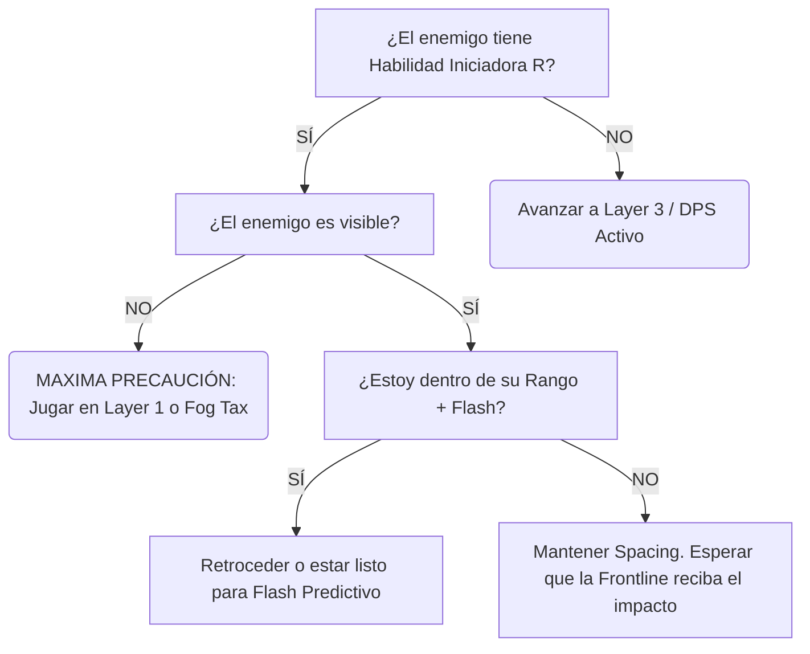

#  Módulo 5: Entrenamiento, VOD Reviews y Elo

## 1. Sistema de Análisis de Muerte (Death Analysis)
En Elo bajo, los jugadores justifican sus muertes diciendo "El campeón enemigo está roto". En Challenger, cada muerte se clasifica rigurosamente.

* **D1 — Mecánico:** Fallaste un click, cancelaste un autoataque, o mediste mal el *Flash*.
* **D2 — Positioning:** Entraste en una *Hard Threat Zone* que deberías haber evitado.
* **D3 — Information:** Moriste porque tomaste una decisión basada en falta de visión (Avanzaste sin saber dónde estaba el jungla).
* **D4 — Greed:** "El Greed". Te quedaste 3 segundos más por una placa de torre o un asesinato extra y la rotación enemiga te castigó.
* **D5 — Weapon Planning:** Fuiste a pelear un objetivo crítico equipado con *Severum y Gravitum* sin munición, siendo inútil en la Teamfight.
* **D6 — Tempo:** Regresaste tarde a la base, llegaste tarde al Dragón, moriste tratando de entrar al río a ciegas.

**Regla de Oro:** Tras cada partida, mira la repetición de tus muertes y *oblígate* a clasificarlas. Si la mayoría son D2 o D3, debes repasar el Módulo 1 y 4 de esta guía.

## 2. Plantilla de VOD Review (El Método Coreano)
Usa este formato (copia y pega) para analizar tus partidas guardadas, o las de jugadores profesionales (Deft, Gumayusi, Viper jugando Aphelios):

```yaml
---
REVISIÓN DE TEAMFIGHT CRÍTICA
---
* Armas iniciales y Munición:
* Siguiente arma en cola:
* Threat #1 (Amenaza Principal del enemigo):
* Estado de Mi Flash: [UP / DOWN]
* Posición inicial: [Layer X - Explicación]
* Target Selection (A quién decidí golpear primero):
* Primer Error (El momento exacto donde la geometría colapsó):
* Momento donde podía avanzar (Ventana ignorada):
* DPS Uptime Efectivo:
* Resultado (Win/Loss de la TF):
* CORRECCIÓN A FUTURO: "La próxima vez que un Malphite tenga R y yo no tenga Flash, debo..."
```

## 3. Sistema de Entrenamiento (Drills)
No juegues partidas en piloto automático "para subir de rango". Entra a la herramienta de práctica o en partidas normales con objetivos limitados (Drills).

* **Cursor Accuracy Drill:** Ve al modo práctica. Camina alrededor de un Dummy dando 1 autoataque, luego moviéndote 90 grados perpendicularmente al instante. Si cancelas el ataque por error o haces click en el piso y caminas hacia el Dummy (suicidio), fallaste.
* **Fog Tracking Drill:** Juega 3 partidas enfocado *únicamente* en mirar el minimapa. Si mueres por una emboscada del jungla (Gank), perdiste el drill. Ignora ganar o perder, el objetivo es predecir la posición del enemigo en la niebla.

## 4. Las Diferencias de Elo (El Espejo)

* **Plata/Oro (Silver/Gold Aphelios):**
  - Entiende cómo cambiar armas. Juega mecánicamente decente si nadie lo presiona.
  - *Error Fatal:* Sufre el "Síndrome de Héroe". Intenta hacer 1v1 contra asesinos enemigos (Zed/Talon). Muestra su posición en primera línea (*Layer 4* constante) sin calcular Cooldowns. Ignora completamente el Tempo de las oleadas.
* **Esmeralda/Diamante (Emerald/Diamond Aphelios):**
  - Domina las rotaciones de armas y el macro básico. Se posiciona mejor.
  - *Error Fatal:* Sufre en la predicción avanzada. Es reaccionario (usa flash cuando ve el poder visual, que ya es muy tarde) en lugar de ser anticipatorio. Pierde TFs completas por *Greed* de 1-AA (intentar dar un autoataque extra que no valía el riesgo).
* **Challenger / Profesional:**
  - Juega el mapa entero, no su campeón. Manipula las *Threat Zones* jugando en los bordes de visión. Calcula el T-90 de manera impecable, llegando al dragón siempre con *Crescendum*. Hace *Baiting* al enemigo bailando al milímetro en el límite exacto del rango enemigo para hacerles gastar sus Ultimates en el vacío (Teoría de Espacio). 

---

## 5. El Árbol de Decisiones Básico (Ejemplo Práctico)



*(Puedes copiar la estructura lógica superior para adaptarla a cualquier Asesino o Magos de Control)*

---

## 6. Los Maestros del Arma (A Quién Estudiar)

Para dominar a Aphelios, **no debes copiar a un solo jugador**. Debes extraer la mayor fortaleza de cada experto mundial y fusionarlas.

### Los Profesionales (Piezas del Rompecabezas)
Si mides el rendimiento competitivo acumulado, estos son los monstruos que definen el límite mecánico de Aphelios. Busca sus VODs en YouTube (Ej: *"Ruler Aphelios Pro View"*).

* **Ruler** ➔ **Posicionamiento y DPS:** Con un 74.6% WR histórico en 63 partidas profesionales, Ruler te enseñará a mantener la distancia perfecta (Spacing) y cómo hacer daño constante sin morir.
* **Viper** ➔ **Mecánicas y Límites:** Úsalo para aprender *Animation Canceling* perfecto y cómo pelear duelos 1v1 que parecen imposibles.
* **GALA** ➔ **Teamfights (Peleas de Equipo):** Juega 87 partidas competitivas. Maestro absoluto en el caos de 5v5.
* **Peyz** ➔ **El ADC Moderno:** Fluidez y posicionamiento vanguardista.
* **Gumayusi** ➔ **Ejecución Front-to-Back:** Obsérvalo para aprender a derretir a la Frontline enemiga de forma metódica y segura.
* **JackeyLove** ➔ **Agresividad y Ventanas de Daño:** Te enseñará los límites del *Damage Greed* calculado. Cuándo usar destello hacia adelante (Flash Forward) para exterminar al equipo enemigo.

> **La Quimera Perfecta:** *Macro de Ruler + Spacing de Viper + Teamfight de GALA + Agresividad de JackeyLove.*

---

### La Élite del SoloQ (OTPs Globales)
A diferencia de los profesionales que juegan con equipos coordinados, estos jugadores te enseñarán cómo ganar partidas caóticas en *SoloQ*.

| Rango | Jugador | Región | Elo (LP) | WR Aphelios | Partidas |
|:---:|---|:---:|---:|---:|---:|
|  | **APHELIKING#6666** | EUNE | Challenger 2635 LP | **63.8%** | 351 |
|  | **POLSKI GUMAYUSI#SKTT1** | EUNE | Challenger 2398 LP | 55.5% | **695** |
|  | **aa5a#aaa** | 🇰🇷 KR | Challenger 1852 LP | **57.2%** | 367 |
|  | **Korotsuka#0211** | 🇧🇷 BR | Grandmaster 1862 LP | 58.6% | 237 |
|  | **Sorcerer Supreme#7777** | EUNE | Grandmaster 1944 LP | 78.8% | 33 |
|  | **Chill1000#larry** | 🇪🇺 EUW | Challenger 2326 LP | 54.3% | 219 |
|  | **Ancano#1999** | 🇪🇺 EUW | Master ~1300 LP | **72.0%** | 125 |
|  | **lil hurk#NA1** | 🇺🇸 NA | Grandmaster 1283 LP | **61.7%** | 162 |
|  | **bbeNjlol#001** | 🇧🇷 BR | Challenger 2147 LP | 56.1% | 164 |

*(Fuente y Rankings en Tiempo Real: [League of Graphs - Aphelios Rankings](https://www.leagueofgraphs.com/rankings/summoners/aphelios))*

---

### Directorio de Streamers y VODs
Para ver transmisiones de OTPs (One-Trick Ponies) en directo o repeticiones de partidas específicas contra ciertos campeones, utiliza el ecosistema de **Onetricks.gg**.

<table style="border-collapse: collapse; width: 100%; border: 1px solid #444;">
  <tr style="background-color: #222;">
    <th style="padding: 10px; border-bottom: 2px solid #555;">Plataforma</th>
    <th style="padding: 10px; border-bottom: 2px solid #555;">Recurso</th>
    <th style="padding: 10px; border-bottom: 2px solid #555;">Estado (Live/VOD)</th>
  </tr>
  <tr>
    <td align="center" style="padding: 10px; border-bottom: 1px solid #444;">
      <br><b>OneTricks.gg</b>
    </td>
    <td style="padding: 10px; border-bottom: 1px solid #444;">
      <a href="https://www.onetricks.gg/es/champions/streamers/Aphelios"><b>Directorio Global de Streamers de Aphelios</b></a><br>
      <i>Sigue a jugadores como 'timelessefls' (Rank 1 EUW) y Challengers coreanos.</i>
    </td>
    <td align="center" style="padding: 10px; border-bottom: 1px solid #444;">
      <span style="color: #e74c3c; font-weight: bold;">🔴 DIRECTOS Y VODs</span>
    </td>
  </tr>
</table>

[⬅️ Volver al Índice Principal](../README.md)
