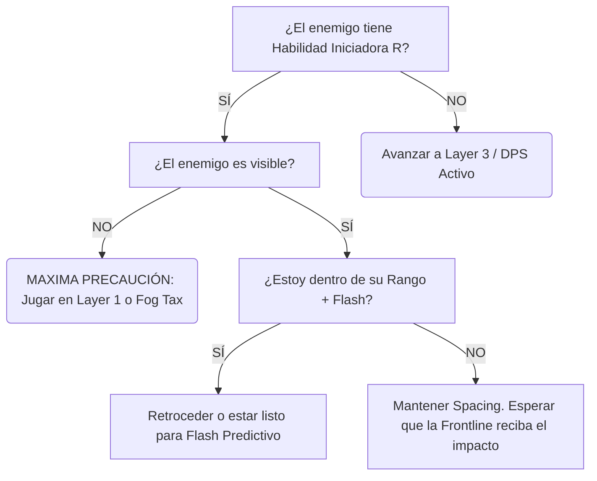

#  Módulo 5: Entrenamiento, VOD Reviews y Elo

## 1. Sistema de Análisis de Muerte (Death Analysis)
En Elo bajo, los jugadores justifican sus muertes diciendo "El campeón enemigo está roto". En Challenger, cada muerte se clasifica rigurosamente.

* **D1 — Mecánico:** Fallaste un click, cancelaste un autoataque, o mediste mal el *Flash*.
* **D2 — Positioning:** Entraste en una *Hard Threat Zone* que deberías haber evitado.
* **D3 — Information:** Moriste porque tomaste una decisión basada en falta de visión (Avanzaste sin saber dónde estaba el jungla).
* **D4 — Greed:** "El Greed". Te quedaste 3 segundos más por una placa de torre o un asesinato extra y la rotación enemiga te castigó.
* **D5 — Weapon Planning:** Fuiste a pelear un objetivo crítico equipado con *Severum y Gravitum* sin munición, siendo inútil en la Teamfight.
* **D6 — Tempo:** Regresaste tarde a la base, llegaste tarde al Dragón, moriste tratando de entrar al río a ciegas.

**Regla de Oro:** Tras cada partida, mira la repetición de tus muertes y *oblígate* a clasificarlas. Si la mayoría son D2 o D3, debes repasar el Módulo 1 y 4 de esta guía.

## 2. Plantilla de VOD Review (El Método Coreano)
Usa este formato (copia y pega) para analizar tus partidas guardadas, o las de jugadores profesionales (Deft, Gumayusi, Viper jugando Aphelios):

```yaml
---
REVISIÓN DE TEAMFIGHT CRÍTICA
---
* Armas iniciales y Munición:
* Siguiente arma en cola:
* Threat #1 (Amenaza Principal del enemigo):
* Estado de Mi Flash: [UP / DOWN]
* Posición inicial: [Layer X - Explicación]
* Target Selection (A quién decidí golpear primero):
* Primer Error (El momento exacto donde la geometría colapsó):
* Momento donde podía avanzar (Ventana ignorada):
* DPS Uptime Efectivo:
* Resultado (Win/Loss de la TF):
* CORRECCIÓN A FUTURO: "La próxima vez que un Malphite tenga R y yo no tenga Flash, debo..."
```

## 3. Sistema de Entrenamiento (Drills)
No juegues partidas en piloto automático "para subir de rango". Entra a la herramienta de práctica o en partidas normales con objetivos limitados (Drills).

* **Cursor Accuracy Drill:** Ve al modo práctica. Camina alrededor de un Dummy dando 1 autoataque, luego moviéndote 90 grados perpendicularmente al instante. Si cancelas el ataque por error o haces click en el piso y caminas hacia el Dummy (suicidio), fallaste.
* **Fog Tracking Drill:** Juega 3 partidas enfocado *únicamente* en mirar el minimapa. Si mueres por una emboscada del jungla (Gank), perdiste el drill. Ignora ganar o perder, el objetivo es predecir la posición del enemigo en la niebla.

## 4. Las Diferencias de Elo (El Espejo)

* **Plata/Oro (Silver/Gold Aphelios):**
  - Entiende cómo cambiar armas. Juega mecánicamente decente si nadie lo presiona.
  - *Error Fatal:* Sufre el "Síndrome de Héroe". Intenta hacer 1v1 contra asesinos enemigos (Zed/Talon). Muestra su posición en primera línea (*Layer 4* constante) sin calcular Cooldowns. Ignora completamente el Tempo de las oleadas.
* **Esmeralda/Diamante (Emerald/Diamond Aphelios):**
  - Domina las rotaciones de armas y el macro básico. Se posiciona mejor.
  - *Error Fatal:* Sufre en la predicción avanzada. Es reaccionario (usa flash cuando ve el poder visual, que ya es muy tarde) en lugar de ser anticipatorio. Pierde TFs completas por *Greed* de 1-AA (intentar dar un autoataque extra que no valía el riesgo).
* **Challenger / Profesional:**
  - Juega el mapa entero, no su campeón. Manipula las *Threat Zones* jugando en los bordes de visión. Calcula el T-90 de manera impecable, llegando al dragón siempre con *Crescendum*. Hace *Baiting* al enemigo bailando al milímetro en el límite exacto del rango enemigo para hacerles gastar sus Ultimates en el vacío (Teoría de Espacio). 

---

## 5. El Árbol de Decisiones Básico (Ejemplo Práctico)



*(Puedes copiar la estructura lógica superior para adaptarla a cualquier Asesino o Magos de Control)*

[⬅️ Volver al Índice Principal](../README.md)
